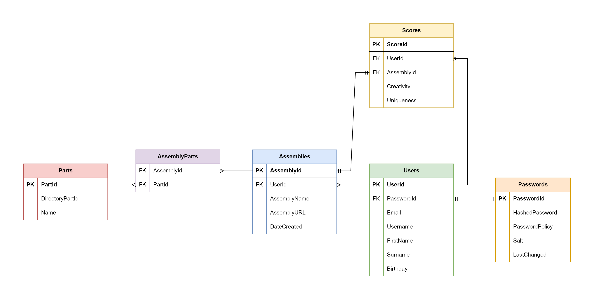

# BrickConnect

A solution based on a CLEAN architecture with 4 logical levels and 3 implementation levels.

Based on the C4 models (https://c4model.com/)

Level 1:

Level 2:

Level 3:

Database Layout:
